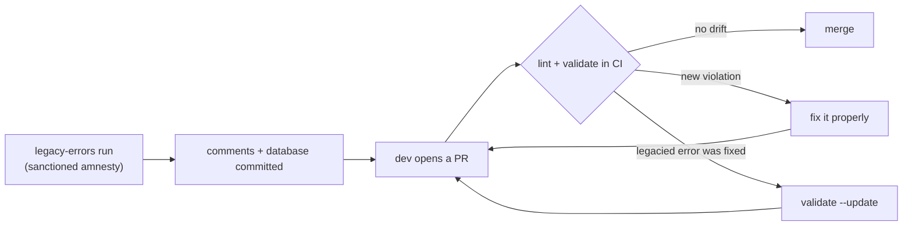

# Legacy Lint Manager

[](https://badge.fury.io/js/legacy-lint-manager)  [](https://codecov.io/gh/nebrius/legacy-lint-manager)

Legacy Lint Manager makes it easy to enable new, wide-reaching lint rules on an existing codebase, without having to spend time fixing all the failures first. New violations are caught and legacied violations are tracked.

Let's say you want `no-floating-promises` set to `error`, but the codebase has 5,000 existing violations and there's no time to fix them anytime soon. Legacy Lint Manager marks every existing violation as _legacied_ with a tracked disable comment. New violations fail CI and the error count ratchets down as legacied errors are fixed.

Legacy Lint Manager works with ESLint 9/10 and Oxlint, works with any package manager, and works in both single-package repos and monorepos.

New here? Start with [Getting started](#getting-started). Sent here by a CI failure? Jump to [When validate fails your PR](#when-validate-fails-your-pr).

## Getting started

This walkthrough takes a simple single-repo project from install to its first legacied errors. See [Using validate in CI](#using-validate-in-ci) for instructions on setting up a CI validation step.

Install as a dev dependency with your package manager of choice:

```sh
npm install --save-dev legacy-lint-manager
```

Then, from the repo root, run the interactive setup:

```sh
npx legacy-lint-manager init
```

`init` walks you through a short series of prompts:

- **Linter detection** is automatic. You're only asked which linter you use if the answer is ambiguous (both an ESLint and an Oxlint config present, or neither).
- **Lint command**: the command that produces your lint results as JSON, e.g. `npx eslint . --format=json` (though running your existing lint script through your package manager is usually better). See [`lintCommand`](#lintcommand) for the details and constraints.
- **Ignore warnings**: answering Yes legacies only errors, while answering No legacies both errors and warnings.
- **Monorepo mode**: whether or not to fan out across workspace packages. This prompt appears even in single repos, so answer No for this walkthrough. See [Monorepos](#monorepos).
- **Pragma**: the text prefix for every legacy comment. The default is `This lint error is legacied. DO NOT COPY`. The pragma isn't just informational though: it's used as part of validation. See [How it works](#how-it-works) for more information.
- **Non-disableable rules**: rules that may never be suppressed, except for legacied errors. When exactly one ESLint flat config is found you get an autocomplete picker of your configured rules; otherwise (including for Oxlint) it's a comma-separated text prompt. See [The suppression philosophy](#the-suppression-philosophy) before going wild here so that the list is appropriately scoped.
- **Compare branch**: the branch that validation compares against and defaults to your default branch (e.g. `main`). You almost never want to change this.
- **Database file**: where the legacy database lives, relative to the config file.

When it finishes, `init` has written two files: `legacy-lint.config.jsonc` and an empty database file (default `legacy-lint.data.json`). Now mark the existing violations as legacied:

```sh
npx legacy-lint-manager legacy-errors
```

This runs your lint command, and Legacy Lint Manager inserts a tracked disable comment for each violation it finds. Here is an example legacy for the `no-console` lint rule:

```ts
// Before
export function processQueue(queue: Task[]) {
  console.log('processing queue');
}

// After
export function processQueue(queue: Task[]) {
  // eslint-disable-next-line no-console -- This lint error is legacied. DO NOT COPY (no-console) k3xR9_wQzL2v
  console.log('processing queue');
}
```

Reading the comment left to right we see:
1. The standard disable directive with the rule list
2. `--` (the linter's own syntax for attaching a free-form description to a directive)
3. The pragma
4. The rules that were legacied in parentheses
5. A unique 12-character ID

Note: In JSX files, the comment is wrapped in `{/* ... */}` automatically when needed.

The database file now has one entry per legacied comment, mapping each ID to its rules:

```json
[["k3xR9_wQzL2v", ["no-console"]]]
```

Now, commit the modified source files, the config, and the database. They work in concert, and the database is only meaningful for the code it was generated against.

The final step is wiring `validate` into CI, which makes legacies durable. Without it, nothing stops new suppressions from creeping in. **Do this in a separate PR after the one above merges.** See the [bootstrap note](#wiring-it-up) for more details on why splitting into two separate PRs is necessary.

Optionally, if AI coding agents work in your codebase, install the companion agent skill so they know how to resolve validation failures correctly:

```sh
npx skills add nebrius/legacy-lint-manager
```

The skill works with Claude Code, Cursor, Copilot, and any other agent that supports the [Agent Skills](https://agentskills.io) standard. See [When validate fails your PR](#when-validate-fails-your-pr) for more information on the skill.

## How it works

To summarize what Legacy Lint Manager does: `legacy-errors` grants amnesty to old lint errors exactly once, records every grant in a ledger, and `validate` makes sure the ledger and the code never drift apart.

### The three artifacts

**The legacy comment** is a standard disable comment with an added paper trail:

```ts
// eslint-disable-next-line no-console -- This lint error is legacied. DO NOT COPY (no-console) k3xR9_wQzL2v
// └── standard lint disable comment ───┘ └──────────────── pragma ──────────────┘ └ legacied ┘ └─── ID ───┘
```

The linter only analyzes what comes before the `--`. If the pragma comes right after the `--`, then everything after it is Legacy Lint Manager's bookkeeping.

**The database** is a committed JSON file that tracks each legacy comment ID, and the rules it legacied. Note that it _doesn't_ contain file paths or line numbers. The comment lives in the code and travels with it, so you can move a file, rename it, or refactor around a legacied line freely without breaking anything or needing to update anything.

**The config** (`legacy-lint.config.jsonc`) holds the settings both commands share. It's written once by `init` and edited by hand after that. See the [Configuration file](#configuration-file) reference for more details.

### The ratchet

`validate` rebuilds the full picture from source on every run: it scans the repo, parses every legacy comment, and cross-checks against two baselines:

1. **The database**: every comment's ID must be registered, used exactly once, and cover only the rules recorded for it. This is what makes copying a legacy comment (or hand-editing one to cover more rules) a CI failure rather than a free suppression.
2. **The compare branch**: the database and most config values are read from the compare branch via git and compared against the working copies. The database may _shrink_ relative to the compare branch (fixing legacied errors is always allowed, and celebrated), but it may never grow. Similarly, enforcement settings such as the pragma, non-disableable rules, ignored packages, and so on can't be loosened.

The asymmetry where removals are always allowed but additions are never allowed is the ratchet. When the count shrinks, the ratchet moves to the next notch.

Note that `validate` never runs your linter, and is intended to be run in tandem with it. To put it another way: the linter catches new _violations_ and validate catches new _suppressions_. A proper CI uses both, which is why the recommended wiring in [Using validate in CI](#using-validate-in-ci) chains them.

You might be wondering: why do comments contain a randomly generated ID? IDs pin each comment to its ledger entry so that duplication and drift are mechanically detectable. Generation collisions are a non-issue in practice: with 12-character IDs, even a codebase with 100,000 legacied errors has roughly a 1-in-a-trillion chance of a collision, and if you ever hit one, `legacy-errors` detects it and refuses to write the database.

<!-- TODO(pre-publish): render to SVG via `npx @mermaid-js/mermaid-cli -i` and embed as an image; npm does not render mermaid blocks, GitHub does. The [!IMPORTANT] alert in "Using validate in CI" has the same problem. -->



### The suppression philosophy

"Rules are meant to be broken, except the ones that aren't." - me, probably

Legacy Lint Manager doesn't do anything to prevent non-legacy lint disable comments by default. Legacy lint disable comments and your own lint disable comments live side by side in harmony (or maybe disharmony?). Sometimes, though, you want to enforce that a rule must never be disabled. Some rules catch problems that are dangerous under any circumstance and have no legitimate exceptions.

In a greenfield codebase you would use the [no-restricted-disable](https://eslint-community.github.io/eslint-plugin-eslint-comments/rules/no-restricted-disable.html) rule from eslint-plugin-eslint-comments. In an older codebase, though, that rule would flag the legacy suppressions created by `legacy-errors`. Instead, you can use Legacy Lint Manager's `nonDisableableRules` list in your `legacy-lint.config.jsonc` file. This acts just like `no-restricted-disable`, except that it allows legacied failures to remain.

That list should be short and curated, and almost never "All The Rules! (🧹)". Let's take these two examples:

- `no-explicit-any` is a rule worth enforcing strictly, but `any` does have a few legitimate uses every now and then in many codebases. A developer who writes `// eslint-disable-next-line @typescript-eslint/no-explicit-any` _with a really good reason_ should be allowed to, so we shouldn't mark it as non-disableable.
- `import/no-cycle` is different though. A new dependency cycle is never a valid choice because import cycles can always be broken through proper splitting or combining of files. This rule is an ideal candidate for non-disableable status.

### Who runs what

`legacy-errors` is for the owners of a codebase's lint infrastructure. Typically this is a DevX or platform team at a large company, or one lone developer who cares at a small company (it's me, I'm that one lone developer). This command is meant to run rarely: first when Legacy Lint Manager is adopted, and again when new rules are enabled. I strongly recommend that you do not add an npm script for this command, since a script invites discovery and casual use. A little friction is a feature for a command whose job is granting amnesty.

`validate` is for everyone, whether running locally or in CI.

The pragma's "DO NOT COPY" is the social contract in three words: legacy comments are grants, not templates. Copying one is flagged as a [duplicate legacy ID](#duplicate-legacy-id-x-each-legacy-id-can-only-be-used-once), hand-writing one is detected as an [unregistered legacy error](#unregistered-legacy-error-new-errors-cannot-be-legacied), and editing one to cover more rules is detected as [not defined in the database](#rule-x-for-legacy-id-y-is-not-defined-in-the-database).

## Using validate in CI

CI is where the ratchet actually engages. This section assumes you've read [How it works](#how-it-works).

> [!IMPORTANT]
> Make sure you include `fetch-depth: 0` in your CI workflow. Validate reads the database and config from the compare branch using `git show`. CI checkouts rarely have a local `main` branch, so validate falls back to `origin/main` automatically when `main` alone doesn't resolve. The remote-tracking ref still has to exist though, and the default checkout on most CI systems fetches only the PR's ref. Alternatively, you can add an explicit `git fetch origin main` step if you prefer not to include `fetch-depth: 0`.

### Wiring it up

The recommended wiring is to append `validate` to the lint script you already run in CI:

```json
{
  "scripts": {
    "lint": "eslint . && legacy-lint-manager validate",
    "lint:fix": "eslint . --fix"
  }
}
```

This reuses the CI job that already runs lint, needs no path setup (`node_modules/.bin` is on `PATH` inside npm scripts), and gives developers validation feedback locally on `npm run lint`. I recommend you keep a separate `lint:fix` script. npm appends passthrough args like `npm run lint -- --fix` to the end of the script chain, where `--fix` would land on `validate` and fail it.

In a monorepo where a task runner fans lint out per package, append at the root script only:

```json
{
  "scripts": {
    "lint": "turbo run lint && legacy-lint-manager validate"
  }
}
```

Do not append to the per-package lint scripts. Legacy Lint Manager operates at the repo level, not package level, and would run the same repo-wide validation N times if you do.

You can also wire validate as a separate job in your CI workflow:

```yaml
jobs:
  validate-legacies:
    runs-on: ubuntu-latest
    steps:
      - uses: actions/checkout@v7
        with:
          fetch-depth: 0
      - uses: actions/setup-node@v7
        with:
          node-version: 24
          cache: npm
      - run: npm ci
      - run: npx legacy-lint-manager validate
```

**Bootstrap note: enable the check in a second PR.** Since validate reads the compare branch's copy of the config and database, it can't pass before those files exist on the compare branch. Enable the CI check (lint-script and/or workflow changes) in a separate PR _after_ merging the adoption PR (comments + config + database generation). Combining these in a single PR will cause an exception to be thrown and fail the CI job.

**Companion check: unused disable directives.** Legacy comments are only vetted for being _registered_, not for still being _needed_. A legacied line whose violation was fixed leaves a stale disable comment behind unless your linter flags it. Both linters can, but the flag semantics are inverted between them, so use the right form:

- **ESLint**: the CLI flag `--report-unused-disable-directives` fails CI, and so does the flat-config form `linterOptions: { reportUnusedDisableDirectives: "error" }`. The trap is the boolean form: `reportUnusedDisableDirectives: true` only _warns_ and exits 0.
- **Oxlint**: the trap is the bare CLI flag: `--report-unused-disable-directives` only warns and exits 0, silently doing nothing for CI. Use `--report-unused-disable-directives-severity=error`, or in `.oxlintrc.json`: `"options": { "reportUnusedDisableDirectives": "error" }` (root config only; CLI flags take precedence).

### Re-legacying after adding rules

When you enable new rules on an already-legacied codebase, you have two options: fix the violations outright before enabling the rule (usually the preferred approach, since it's a one-time cost and the rule starts clean), or legacy them. For the latter:

1. **Run `validate` first** and get it passing. `legacy-errors` refuses to build a database on top of existing validation errors, and it can't detect problems that only exist for rules it hasn't seen yet. A failed attempt leaves partially-applied legacy comments in your tree that you'll have to revert.
2. Enable the new rules in your lint config and run `legacy-errors`. New violations get comments and database entries; existing legacies are preserved.
3. Open the PR. **It will fail the validate check, by design.** The database grew relative to the compare branch, which is exactly what the ratchet exists to block. Disable the validate check for this PR and re-enable it in a follow-up PR. Alternatively, you can get an admin to do an override merge.

I deliberately keep this process inconvenient so that `legacy-errors` doesn't become a lazy way to avoid fixing newly introduced lint errors.

## Monorepos

Monorepo mode changes how work is fanned out, but everything conceptual stays the same. This section covers only what's unique to monorepo mode.

**Enabling it.** Monorepo mode is on when the config contains a `monorepoConfig` object (`init` defaults the prompt to Yes when it detects a workspace).

**Execution model.** The two commands fan out differently:

- `legacy-errors` runs the configured lint command once per workspace package, with that package's directory as the working directory. The repo-level `lintCommand` runs in every package folder, so it must work in every package. Your command is likely already normalized if you run `turbo run lint` or `nx run-many -t lint`.
  - A package that genuinely needs a different invocation can override the command for itself. See [package config overrides](#package-config-override-files) for more information.
- `validate` does not run the lint command at all. It walks each package's source files and parses comments using [oxc-parser](https://www.npmjs.com/package/oxc-parser) (a Rust-based high-performance parser), then validates everything against the one shared database in a single pass.

In both modes there is exactly one database, at the repo root. There is also exactly one repo-level config, but packages can override some of its settings for themselves.

**Package config overrides.** Sometimes one package legitimately differs from the rest of the repo because it needs its own lint invocation or it needs extra non-disableable rules. For these cases, add a `legacy-lint.config.jsonc` file at that package's root.

Only two settings can be overridden: `lintCommand`, which _replaces_ the repo-level command for that package, and `nonDisableableRules`, which _adds to_ the repo-level list for that package.

`nonDisableableRules` entries in a package config override are enforced like they are in the repo root config. Removing rules from an override, or deleting an override file that contains rules, fails validation just like removing repo-level rules does. See [Package config override files](#package-config-override-files) for the full reference.

**Ignoring packages.** While I strongly discourage you from opting packages out of validation, if you have a valid reason to do so, you can add workspace-relative paths to `monorepoConfig.ignorePackagePaths`. Ignored packages are skipped by both commands. One sanctioned and useful use-case for ignoring packages is to onboard packages one at a time in a monorepo. See ([Monorepos](#monorepos)) for more information.

An entry can also end in a simple wildcard, e.g. `"sandbox/*"`, which ignores every package under that directory. The `*` must be the last character and must come right after a slash, so `sandbox*` and `sand*/box` are both rejected when the config is read.

**Important:** a wildcard also matches packages added under that directory in the future, without a config change for the ratchet to catch. Use it for directories that are ignored as a matter of policy, not as shorthand for today's list of exceptions.

Note: a path that doesn't match any workspace package is a hard error during validation, and _adding_ new ignored packages is blocked by the compare-branch ratchet like any other enforcement loosening. Growing the ignore list requires you to go through the same steps as re-legacying a codebase.

**Un-ignoring packages for staged adoption.** Removing entries is a different story, and it's the sanctioned way to adopt a monorepo in stages. Sometimes some packages are in bad enough shape that it doesn't make sense to legacy them yet. Some examples:

- The lint config is not fully functional, leading to non-lint-rule errors.
    - For example, there may not be a parser available to parse a file, or a TypeScript file isn't included in the default tsconfig.
- There might be a lot of fixes that can be applied with `--fix`, and it makes more sense to fix them than legacy them

In these cases, I recommend adding them to `ignorePackagePaths`, setting up CI after legacying non-ignored packages, and then onboarding them one at a time. To onboard a package: delete the package's entry, run `legacy-errors` to generate its comments and database entries, and put the whole thing up as one PR.

If you plan to onboard packages one at a time, I recommend that you list them individually instead of using a wildcard. When you use a wildcard, you can only onboard all packages covered by the wildcard, thus coupling them together.

Validation allows new database entries when their legacy comments live in a package that was just removed from the ignore list, so onboarding a package doesn't require the CI coordination dance described in [Re-legacying after adding rules](#re-legacying-after-adding-rules).

This workflow is safe to follow and doesn't loosen the ratchet. Since additions to the ignore list are blocked, each package can go through this one-way onboarding flow exactly once.

**Boundaries to be aware of:**

- Files not in a workspace package are not analyzed.
- Workspace discovery follows your tool's own markers: npm, yarn, and bun are detected via their lockfiles; pnpm via `pnpm-workspace.yaml`; Lerna via `lerna.json`. A `workspaces` field in `package.json` with none of those present falls back to single-package behavior. See [@manypkg/get-packages](https://www.npmjs.com/package/@manypkg/get-packages) for more information.
- Converting a repo between single-repo and monorepo mode fails validation by design. Such a conversion needs a sanctioned PR, just like any other enforcement-affecting config change.
- Package config override checks only cover packages that exist on your branch. If a PR deletes or renames a package folder, that package's override (and any non-disableable rules it declared) leaves the ratchet along with it. This is by design, since the rules only governed code that no longer exists.
  - _Important:_ this means a rename that also drops override rules isn't flagged.
- If `legacy-errors` fails partway through the package list, the remaining packages are not processed (note: `validate` always checks every package before reporting).

## When validate fails your PR

Each heading below is the error message you saw, roughly ordered by how often people hit them. When several related messages share one entry, the extras are listed in bold inside it.

If an AI agent is the one staring at these errors, this repo also ships an agent skill covering everything in this section, rewritten as instructions for agents. Install it into your repo with `npx skills add nebrius/legacy-lint-manager`. The skill only covers validation on purpose: initialization and legacying are rare, human-driven operations, and this README covers them well enough for agents.

Note: one class of failures missing from this list are ones that come from git itself, not this tool. A raw `fatal:` error means there is a problem reading the database, config, or package config override files from the branch being compared with. See [Wiring it up](#wiring-it-up) for more information.

### "Rule X cannot be disabled."

You added a suppression for a rule your repo has marked non-disableable, meaning no _new_ suppressions of it are allowed. Existing legacied violations of this rule are exempt because they predate the rule being marked non-disableable. You must fix the violation instead of suppressing it.

### "Disabling all rules is not allowed because some rules are configured as non-disableable"

A disable directive with no rule list (a blanket `/* eslint-disable */`, or a bare `// eslint-disable-next-line`) turns off everything, including the non-disableable rules, so it's rejected whenever any non-disableable rules are configured. List the specific rules you intend to disable instead.

### "Duplicate legacy ID X. Each legacy ID can only be used once."

The same legacy ID appears in more than one comment, which means a legacy comment was copy-pasted, which the "DO NOT COPY" in the pragma warned you not to do. A legacy comment is a one-time grant for one specific violation, not a reusable template. Remove the copied comment and fix the new violation instead of disabling it.

### "Rule X for legacy ID Y is not defined in the database"

A legacy comment claims to legacy a rule that its database entry doesn't include. This almost certainly means someone hand-edited a legacy comment to piggyback another rule onto an existing grant. Revert the edit, and if the new violation is real, fix it.

### "Malformed legacy comment"

A legacy comment no longer parses, usually from hand-editing or merge damage. Restore it to its original form from git history, or remove it and fix the violation.

Related message with the same cause and fix:
- **"Legacy comment must use \*-disable-next-line"** - a legacy comment was converted to a block or same-line disable, which isn't supported

### "Rule X in legacy comment is not in the actual lint disable list."

A rule in a legacy comment was removed from the actual lint disable comment, e.g. `// eslint-disable-next-line foo -- {pragma} (foo, bar) {id}`. This usually means the rule's violation was fixed and the disable was trimmed to match, congrats! Run:

```sh
npx legacy-lint-manager validate --update
```

and commit the result: the rule is pruned from the legacy rules list, and the database is updated to match.

The same applies to **"Legacy comment has no valid rules and should be removed"**, where the legacy rules list has no rules left in the disable list at all, e.g. `{pragma} () {id}`. For those, `--update` removes everything in the comment from the `--` to the end, leaving a plain disable comment.

### "Errors parsing file"

A source file contained syntax errors, so validate can't fully analyze the file. Fix the syntax error and validation will proceed.

### "ESLint configuration comments are not supported"

The file uses an in-file configuration comment like `/* eslint "some/rule": "error" */`. These change rule behavior in ways this tool doesn't track, so they're rejected. Move the configuration into your ESLint config file.

Note: this is also listed under [Known limitations](#known-limitations).

### "Legacy ID X does not exist in the database on BRANCH. New legacy entries cannot be added."

The database in your PR contains entries that don't exist on the compare branch, meaning the database grew. The fix is to revert your database changes. The same applies to **"New rules cannot be added to existing legacy entries."**, which is the database-file edit variant of the same drift.

There is one exception: entries whose legacy comments live in a package that your PR removed from `ignorePackagePaths` are allowed, because that package is being onboarded ([Monorepos](#monorepos)). If you did exactly that and still see this error, either the flagged entry doesn't belong to the package you un-ignored, or its database entry lists rules beyond what its legacy comment declares.

### Config drift errors

A family of errors of the form "…does not match… the compare config", covering the pragma, `ignoreWarnings`, the compare branch itself, removal of non-disableable rules (**"Non-disableable rules cannot be removed from the compare branch."**), newly ignored packages (**"New ignored packages cannot be added to the config."**, plus **"Unknown ignore package path X"** and **"Ignore package path wildcard X did not match any packages"** for entries matching no package), and single↔monorepo conversion. All of them mean that enforcement settings changed relative to the compare branch, which is not allowed.

The same ratchet covers [package config override files](#package-config-override-files): **"Package config override file X is missing non-disableable rules that were present in the compare branch"** means rules were removed from an override, and **"Package config override file X was deleted but it included non-disableable rules."** means an override that carried rules was deleted outright. Restore the rules (or the file).

Note: this error only occurs when the package is still present. Package deletes and renames are not erroneously flagged.

### "Unregistered legacy error. New errors cannot be legacied."

A legacy comment carries an ID that isn't in the database at all. Since `legacy-errors` always registers what it writes, this means the comment was written or edited by hand with an invented ID. Remove the comment and fix the violation.

### "Legacied lint errors were fixed, good job!"

The one happy failure: violations that were legacied no longer exist in the code, so their database entries are now stale. Run:

```sh
npx legacy-lint-manager validate --update
```

and commit the updated files. Shrinking the database means you're making progress on cleaning up the codebase, congrats!

### Resolving merge conflicts on the database file

It's uncommon to run into merge issues with Legacy Lint Manager because all legacy comments and the database itself each live on a single line. This means it's impossible for a git merge to corrupt a comment or the database by mixing two states, since this only happens with multiline text.

That said, it's still possible to run into classic git conflicts when two branches shrank the database. Git will _always_ flag this as a merge conflict. When you hit that conflict, the resolution is mechanical, but the direction matters:

1. Take the compare branch's side of the conflict. Watch out for which side that actually is: during a merge the compare branch is usually `--theirs`, but during a rebase it's usually `--ours`.
2. Run `npx legacy-lint-manager validate --update` and commit the result. This prunes any entries whose comments no longer exist in the merged code.
3. If that run fails with "Unregistered legacy error", the violation behind that comment was already fixed on the compare branch, so its grant is gone. Remove the comment, fix the violation, and run `--update` again.

**Important**: do _not_ take your own branch's side, and don't hand-merge the JSON. Your side can contain entries that the compare branch removed, and validation rejects those as new entries before `--update` gets a chance to clean anything up, leaving you stuck until you re-resolve with the compare branch's version.

## Reference

This section is an exhaustive-but-terse reference of config files and commands, but assumes you are already familiar with the concepts from [How it works](#how-it-works).

### Configuration file

By default, the configuration file is named `legacy-lint.config.jsonc` and lives at the repo root. The file is JSON-C, which means that comments and trailing commas are allowed.

```jsonc
{
  "linterType": "eslint",
  "lintCommand": {
    "command": "npx",
    "args": ["eslint", ".", "--format=json"],
  },
  "ignoreWarnings": false,
  "pragma": "This lint error is legacied. DO NOT COPY",
  "databaseFile": "legacy-lint.data.json",
  "nonDisableableRules": ["import/no-cycle"],
  "compareBranch": "main",
  // Present only in monorepo mode
  "monorepoConfig": {
    "ignorePackagePaths": [],
  },
}
```

#### linterType

`"eslint"` or `"oxlint"`. Determines how lint results are parsed and which disable-comment dialect is written.

#### lintCommand

The command that produces lint results, as a structured `{ "command": string, "args": string[] }`. These arguments are fed directly to `spawn` with no shell, so shell syntax won't work (quoting, environment variable prefixes, pipes, `&&`). An argument containing spaces must be hand-edited into the config file, since the init prompt doesn't distinguish spaces inside an argument from spaces between arguments. The command must print lint results as JSON to stdout, so you must add the `--format=json` flag to your command. This works for both ESLint and Oxlint.

It runs with the repo root as the working directory in single repo mode, or once per workspace package with that package's folder as the working directory in monorepo mode. That second part is easy to miss: the configured command runs in every package folder, so it must work in every package, with no package-specific paths or flags. You likely have done this already to ensure these commands can be run in bulk using Turbo, Nx, etc.

If a package genuinely needs a different lint invocation, override `lintCommand` for that package in a [package config override file](#package-config-override-files).

**Use a package manager script if you can.** Instead of invoking the linter directly like the `npx` example above, I recommend running the lint script you already have:

```jsonc
// npm
"lintCommand": {
  "command": "npm",
  "args": ["run", "--silent", "lint", "--", "--format=json"],
},

// pnpm
"lintCommand": {
  "command": "pnpm",
  "args": ["--silent", "lint", "--format=json"],
},

// yarn 1
"lintCommand": {
  "command": "yarn",
  "args": ["--silent", "lint", "--format=json"],
},
```

A script is usually better than a direct invocation for a few reasons:

- The script is the same one your main CI lint job runs, so the flags and config that get legacied are exactly the ones CI enforces, and the two can never drift apart.
- Lint scripts often carry important arguments, such as a file pattern or a subdirectory to lint, and reusing the script means you don't have to duplicate them into `lintCommand` and keep them in sync by hand.
- In a monorepo, a package without the script fails loudly instead of silently linting with a config that isn't enforced yet. This happens when a package is partway through adopting lint: an ESLint config exists but CI doesn't run it yet (I like to gate these behind a `lint:future` script). A direct `npx eslint` invocation would happily lint against the unenforced config and legacy errors that CI never checks.

Two things to get right when doing this:

**The silent flag is required.** npm, pnpm, and yarn all echo the script line to stdout before running it (e.g. the `> my-package@1.0.0 lint` banner), which corrupts the JSON that `legacy-errors` parses. The silent flag prevents the banner from being shown. I recommend putting the flag in `lintCommand`, not in the script itself, since the verbosity is usually desirable when the script is run normally.

Note: npm accepts `--silent` anywhere before the `--`, but pnpm and yarn treat everything after the script name as passthrough arguments for the script, so `--silent` must come before the script name as shown in the examples above.

#### ignoreWarnings

When `true`, lint _warnings_ are ignored and only errors are legacied. When `false`, warnings get legacy comments too. Checked by the config-drift ratchet.

#### pragma

The text prefix for every legacy comment. If you go with a non-default pragma, you should keep the spirit of the default (`This lint error is legacied. DO NOT COPY`). Not only is this pragma a signal to this tool, it's also a social contract rendered inline that makes it far more likely that devs and agents will respect it. Changing it after adoption fails the config-drift check.

#### databaseFile

Path to the legacy database, which is resolved relative to the config file and should be committed to git. See [the FAQ](#why-is-the-database-committed) for more information.

#### nonDisableableRules

Rules that may never be suppressed, but violations that were legacied by `legacy-errors` remain sanctioned. Think of this as a legacy-aware version of eslint-plugin-eslint-comments' rule bans. The list should be kept relatively short, as per the [philosophy](#the-suppression-philosophy). Removing entries is blocked by the config-drift ratchet, but adding new rules is allowed. In monorepo mode, a package can add additional rules for itself via a [package config override file](#package-config-override-files).

Note for Oxlint: rule names are matched the way Oxlint itself matches them, which ignores plugin prefixes. See [Known limitations](#known-limitations) for more information, because this can be a pretty big footgun if you're not careful.

#### compareBranch

The branch whose committed database and config are the ratchet baseline, usually your default branch (e.g. `main`). Validate falls back to `origin/<branch>` automatically if the branch doesn't resolve locally, so CI only needs to fetch the remote-tracking ref, as discussed in [Wiring it up](#wiring-it-up).

#### monorepoConfig

Presence of this object enables monorepo mode ([Monorepos](#monorepos)). Its one field, `ignorePackagePaths`, lists workspace packages to skip, resolved relative to the config file. An entry ending in `/*` skips every package under that directory. Entries are validated to ensure each path matches at least one workspace package, and additions are blocked by the config-drift ratchet. Removing an entry is allowed, and lets the same PR seed that package's legacy comments and database entries, which is the staged-adoption path described in [Monorepos](#monorepos).

### Package config override files

When monorepo mode is enabled, a package can override parts of the repo config by placing its own config file at the package root. The file is always named `legacy-lint.config.jsonc`, even if you point the CLI at a custom repo config via `--config`. It's written by hand (`init` never creates one), it's JSON-C like the repo config, and both fields are optional:

```jsonc
{
  // Replaces the repo-level lintCommand for this package
  "lintCommand": {
    "command": "npx",
    "args": ["eslint", ".", "--config=eslint.my-package.mjs", "--format=json"],
  },
  // Added to the repo-level list for this package
  "nonDisableableRules": ["no-restricted-imports"],
}
```

- `lintCommand` _replaces_ the repo-level command when `legacy-errors` runs in this package, with the same constraints as the repo-level version (JSON to stdout, no shell syntax).
- `nonDisableableRules` _extends_ the repo-level list for this package's files: the effective list is the repo rules plus the package rules. There are no mechanisms for removing non-disableable rules from the repo config, by design.

No other settings can be overridden, and unknown fields are rejected.

Override rules are part of the ratchet. Adding an override file, or adding rules to one, is always allowed. Removing rules from an override, or deleting an override file that lists any rules, fails validation the same way removing repo-level rules does. `lintCommand` is not an enforcement setting though, so a `lintCommand` override can be changed or removed freely, including deleting an override file that only contains a `lintCommand`.

Note that the ratchet compares each config file on its own. Moving a rule from the repo config into package overrides is flagged as a removal from the repo config, even if every single package adds it. This is by design, since such a move changes what rules are applied to new packages in the future.

### CLI

Every command exits 0 on success and 1 on failure or validation error. If you need more granularity in exit codes, [file an issue](https://github.com/nebrius/legacy-lint-manager/issues) and let me know your use case.

#### legacy-lint-manager init

Initiates an interactive session to create `legacy-lint.config.jsonc` at the repo root and an empty database file.

Flags:

- `--verbose`: enables verbose logging, including timing diagnostics.

#### legacy-lint-manager legacy-errors

Inserts legacy comments for every reported violation from running the lint command, and (re)builds the database from the resulting source tree. Requires macOS, Linux, or WSL on Windows.

Flags:

- `--config <file>`: the config file to read from. Default: `legacy-lint.config.jsonc` in the current directory.
- `--verbose`: enables verbose logging, including timing diagnostics.

#### legacy-lint-manager validate

Checks the source tree against the database and the compare branch, reporting every violation it finds.

Flags:

- `--config <file>`: the config file to read from. Default: `legacy-lint.config.jsonc` in the current directory.
- `--update`: sync the bookkeeping with fixed violations. Specifically, it prunes rules from legacy comments that are no longer in their disable lists, removes the legacy portion of a disable comment entirely when no legacied rules remain, and shrinks the database to the surviving grants. Note: only runs when validation otherwise passes.
- `--verbose`: enables verbose logging, including timing diagnostics.

## Known limitations

**Detection gaps** (things the comment scanner can't see):

- If a line already has a legacied, non-disableable violation and a _second_ violation of that same rule is later added to the same line, the addition isn't flagged. This matches ESLint/Oxlint behavior because the one existing disable comment covers both violations.
- Changes to your lint config itself aren't tracked. In particular, disabling non-disableable rules via the config file is not reported.
- If every violation on a legacied line is fixed, the legacy comment deleted, and the now-unused legacy comment is then copy-pasted to a new location with new violations of the same rule, Legacy Lint Manager interprets this as a moved comment instead of a new suppression.
- Legacy comments are not vetted against whether they're still needed. I strongly recommend you set up the unused-directives check to keep them from going stale. See [Wiring it up](#wiring-it-up) for more information.
- Only JavaScript and TypeScript files are analyzed (`.js`, `.jsx`, `.ts`, `.tsx`, and their `.cjs`/`.mjs`/`.cts`/`.mts` variants). Vue, Svelte, and other compile-to-JS formats are not supported.

**Linter quirks:**

- In-file ESLint configuration comments (`/* eslint "example/rule1": "error" */`) are not supported and fail validation. This is a very old style of configuring rules that predates flat configs (and I suspect predates file overrides in the old config too). Move them into the ESLint config file.
- Oxlint ignores plugin namespaces when matching disable comments to rules: `@typescript-eslint/no-explicit-any` and `eslint/no-explicit-any` are indistinguishable to Oxlint in `// oxlint-disable`, and this tool matches the same way for accuracy. This has multiple consequences:
  - If you define a non-disableable rule using one prefix (e.g. `@typescript-eslint/no-explicit-any`), it will be non-disableable under all prefixes (including `eslint/no-explicit-any`)
  - A legacy comment for a rule under one prefix also suppresses future violations of that rule reported under any other prefix. Those new violations will never be detected.
  - Rules from different plugins that share a base name but represent (perhaps subtly) different concepts are entangled. Disabling or legacying one suppresses the other, and marking one non-disableable blocks fresh suppressions of the other too.
- A small number of Oxlint rules (5 in v1.71.0) report multi-span diagnostics without exposing which span the disable comment must anchor to, so `legacy-errors` may place the comment on the wrong line for those rules. There is no deterministic fix this tool can implement unfortunately, so you must correct the placement by hand if you hit it.

**Setup and environment:**

- `legacy-errors` is not supported on Windows outside of WSL because it spawns your lint command without a shell. npm on Windows uses `.cmd` shims, which aren't supported in the spawn.
- `init`'s automatic detection and rules autocomplete only recognize ESLint _flat_ configs (`eslint.config.*`). If you have an `.eslintrc`-style config, init will fall back to manual prompts (you'll type the non-disableable rules yourself instead of picking from the autocomplete). `legacy-errors` and `validate` are unaffected though, since the tool never loads your ESLint config, only your lint command's JSON output.
- TypeScript flat config (`eslint.config.ts`) will crash `init` on Node versions without native TypeScript type-stripping.
- `init` derives its default compare branch from `origin/HEAD`, which always exists in cloned repos, but not in repos without an origin remote (a fresh `git init`) or after a bare `git remote add`. Without it, init fails before the compare-branch prompt. The prompt also validates against local branches only, so a branch that exists only on the remote is rejected.

**Monorepo mode**: see [Monorepos](#monorepos) for the boundary list (root-level files, workspace detection markers, mode-conversion blocking, override scoping on package deletes/renames, and mid-run failure behavior).

## FAQ

### Why don't you use the ESLint API?

Because I want to run your lint setup exactly as you run it. You can use any ESLint major, any package manager, any wrapper, or Oxlint (which has no Node API at all). Spawning the command you already use means no peer-dependency matching, no binary path resolution, and your exact flags and config.

### Why is the database committed?

The ratchet compares your working database against the compare branch's copy, and `git show` makes that trivial because it doesn't require external storage, third-party services, or authentication.

As a bonus, the database is plain JSON that you can compute stats from, such as total legacied errors over time. These stats can make a nice burn-down chart for a team dashboard. If you need something richer (say, the ability to do a Codecov-style upload to a third-party service), [file an issue](https://github.com/nebrius/legacy-lint-manager/issues) and we can work together to add the appropriate hooks for your use case.

### Can I run legacy-errors from an npm script?

Please don't. It's meant to be deliberately inconvenient. See [Who runs what](#who-runs-what).

### Is there a programmatic API?

Not yet. If you have a use case, [file an issue](https://github.com/nebrius/legacy-lint-manager/issues) describing it. The current internals weren't designed with a public API in mind (and are a bit messy). I'd be happy to add one if there's enough demand and I understand the use cases better.

### Why not ESLint's built-in bulk suppressions?

Two reasons:

1. **Renames**: the suppressions file keys on file paths, so moving a file breaks its suppressions. In contrast, legacy comments live in the code and move with it.
2. **Visibility**: a suppressions file is out of sight and out of mind, since there's no reason to view it while editing code. Legacy Lint Manager's more in-your-face comment on the offending line provides gentle pressure to fix it.

### Does it work with ESLint 8 or older?

ESLint 9/10 is the tested surface. That said, nothing version-specific is consumed at lint time since Legacy Lint Manager only reads the JSON output's core fields (`filePath`, `messages[].ruleId/line/severity`), which have been stable across ESLint majors for most of ESLint's existence. Older versions are expected to work but aren't tested.

One exception is that `init`'s flat-config-only detection will fall back to manual prompts. See [Known limitations](#known-limitations) for more information.
