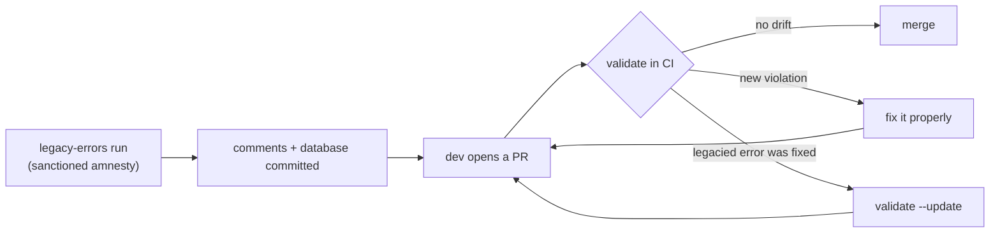

# Legacy Lint Manager

[](https://badge.fury.io/js/legacy-lint-manager)  [](https://codecov.io/gh/nebrius/legacy-lint-manager)

Turn on new lint rules today, without fixing years of old violations first.

Let's say you want `no-floating-promises` set to `error`, but the codebase has 5,000 existing violations and nobody is fixing them this quarter. Legacy Lint Manager marks every existing violation as _legacied_ with a tracked disable comment, then ratchets: new violations fail CI like they always should have, legacied violations stay suppressed until someone fixes them, and once fixed they can never quietly come back.

Works with ESLint 9/10 and Oxlint, with any package manager, in single repos and monorepos.

New here? Start with [Getting started](#getting-started). Sent here by a CI failure? Jump to [When validate fails your PR](#when-validate-fails-your-pr).

## Getting started

This walkthrough takes a simple single-repo project from install to its first legacied errors. CI setup comes after. See [Using validate in CI](#using-validate-in-ci).

Install as a dev dependency with your package manager of choice:

```sh
npm install --save-dev legacy-lint-manager
```

Then, from the repo root, run the interactive setup:

```sh
npx legacy-lint-manager init
```

`init` walks you through a short series of prompts:

- **Linter detection** is automatic. You're only asked which linter you use if the answer is ambiguous (both an ESLint and an Oxlint config present, or neither).
- **Lint command**: the command that produces your lint results as JSON, e.g. `npx eslint . --format=json`. See [`lintCommand`](#lintcommand) for the details and constraints.
- **Ignore warnings**: whether lint _warnings_ should be legacied too, or only errors.
- **Monorepo mode**: whether to fan out across workspace packages. This prompt appears even in single repos, so answer No for this walkthrough. See [Monorepos](#monorepos).
- **Pragma**: the text prefix for every legacy comment. The default is `This lint error is legacied. DO NOT COPY`, and the "DO NOT COPY" part is load-bearing; see [How it works](#how-it-works).
- **Non-disableable rules**: rules that may never be freshly suppressed. When exactly one ESLint flat config is found you get an autocomplete picker of your configured rules; otherwise (including for Oxlint) it's a comma-separated text prompt. See [The suppression philosophy](#the-suppression-philosophy) before going wild here; this list should be relatively short.
- **Compare branch**: the branch CI compares against, usually your default branch.
- **Database file**: where the legacy database lives, relative to the config file.

When it finishes, `init` has written two files: `legacy-lint.config.jsonc` and an empty database file. Now mark the existing violations as legacied:

```sh
npx legacy-lint-manager legacy-errors
```

This runs your lint command, and for every reported violation Legacy Lint Manager inserts a tracked disable comment. A line that looked like this:

```ts
export function processQueue(queue: Task[]) {
  console.log('processing queue');
```

now looks like this:

```ts
export function processQueue(queue: Task[]) {
  // eslint-disable-next-line no-console -- This lint error is legacied. DO NOT COPY (no-console) k3xR9_wQzL2v
  console.log('processing queue');
```

Reading the comment left to right: the standard disable directive with the rule list, then `--` (the linter's own syntax for attaching a free-form description to a directive), then the pragma, then the rules that were legacied in parentheses, then a unique 12-character ID. In JSX positions the comment is wrapped in `{/* ... */}` automatically.

The database file now has one entry per legacied comment, mapping each ID to its rules:

```json
[["k3xR9_wQzL2v", ["no-console"]]]
```

Commit all of it: the modified source files, the config, and the database. They all work in concert with each other, and the database is only meaningful for the code it was generated against.

The final step is wiring `validate` into CI, which is what makes any of this durable. Without it, nothing stops new suppressions from creeping in. **Do this in a separate PR after the one above merges.** The reason is explained in the [bootstrap note](#wiring-it-up).

## How it works

The mental model in one sentence: `legacy-errors` grants amnesty exactly once, records every grant in a ledger, and `validate` makes sure the ledger and the code never drift apart.

### The three artifacts

**The legacy comment** is a normal disable comment with a paper trail:

```ts
// eslint-disable-next-line no-console -- This lint error is legacied. DO NOT COPY (no-console) k3xR9_wQzL2v
// └── standard lint disable comment ───┘ └──────────────── pragma ──────────────┘ └ legacied ┘ └─── ID ───┘
```

The linter only cares about the part before `--`; everything after it is Legacy Lint Manager's bookkeeping. Only `legacy-errors` writes these comments, and humans should never modify them. The pragma is there to mark them as machine-managed.

**The database** is a committed JSON file mapping each ID to the rules it legacied. Note what it _doesn't_ contain: no file paths, no line numbers. The comment lives in the code and travels with it, so you can move a file, rename it, or refactor around a legacied line freely without anything breaking.

**The config** (`legacy-lint.config.jsonc`) holds the settings both commands share. It's written once by `init` and edited by hand after that. See the [Configuration file](#configuration-file) reference.

### The ratchet

`validate` rebuilds the full picture from source on every run: it scans the repo, parses every legacy comment, and cross-checks against two baselines:

1. **The database**: every comment's ID must be registered, used exactly once, and cover only the rules recorded for it. This is what makes copying a legacy comment (or hand-editing one to cover more rules) a CI failure rather than a free suppression.
2. **The compare branch**: the database and the load-bearing config values are read from the compare branch via git and compared against the working copies. The database may _shrink_ relative to the compare branch (fixing legacied errors is always allowed and celebrated), but it may never grow, and enforcement settings (pragma, non-disableable rules, ignored packages, and so on) can't be quietly loosened.

The asymmetry where removals are always allowed but additions are never allowed is the ratchet. The only sanctioned way to add suppressions is another `legacy-errors` run, which is a deliberate, reviewed event.

Why the random IDs? They pin each comment to its ledger entry so that duplication and drift are mechanically detectable. Collisions are a non-issue in practice: with 12-character IDs, even a codebase with 100,000 legacied errors has roughly a 1-in-a-trillion chance of a collision, and if you ever hit one, `legacy-errors` detects it and refuses to write the database.

<!-- TODO(pre-publish): render to SVG via `npx @mermaid-js/mermaid-cli -i` and embed as an image; npm does not render mermaid blocks, GitHub does. -->



### The suppression philosophy

Rules are meant to be broken, except for the ones that aren't.

Ordinary disable comments stay perfectly legal by default. This tool does not police your team's judgment about when a rule doesn't apply; it polices _legacy_ suppressions (which only `legacy-errors` may create). Sometimes, though, you want to enforce that a rule must never be disabled. Normally you would use the [no-restricted-disable](https://eslint-community.github.io/eslint-plugin-eslint-comments/rules/no-restricted-disable.html) rule from eslint-plugin-eslint-comments, but it would flag the legacy suppressions that were created by `legacy-errors`. Instead, you can use Legacy Lint Manager's `nonDisableableRules` list in your `legacy-lint.config.jsonc` file. This acts just like `no-restricted-disable`, except that it allows legacied failures to remain.

That list should be short and curated, and almost never "all rules". Let's take these two examples:

- `no-explicit-any` is a rule worth enforcing strictly, but `any` does have a few legitimate uses. A developer who writes `// eslint-disable-next-line @typescript-eslint/no-explicit-any` with a good reason should be allowed to, so we shouldn't mark it as non-disableable.
- `import/no-cycle` is different: a new dependency cycle is never a deliberate, defensible choice. It's a good non-disableable candidate: no fresh suppression allowed, ever, while violations legacied during adoption remain sanctioned until fixed.

### Who runs what

`legacy-errors` is for the owners of your lint infrastructure. Typically this is a devex or platform team at a large company, or that one developer who cares at a small one (it's me, I'm that one developer). It's meant to run rarely: first when Legacy Lint Manager is adopted, and again when new rules are enabled. I strongly recommend that you do not add an npm script for this command, otherwise it can encourage discovery and use. A little friction is a feature for a command whose job is granting amnesty.

`validate` is for everyone, whether running locally or in CI.

The pragma's "DO NOT COPY" is the whole social contract in three words: legacy comments are grants, not templates. Copying one is detected ([Duplicate legacy ID](#duplicate-legacy-id-x-each-legacy-id-can-only-be-used-once)), hand-writing one is detected ([Unregistered legacy error](#unregistered-legacy-error-new-errors-cannot-be-legacied)), and editing one to cover more rules is detected ([not defined in the database](#rule-x-for-legacy-id-y-is-not-defined-in-the-database)).

## Using validate in CI

CI is where the ratchet actually engages. This section assumes you've read [How it works](#how-it-works).

### Wiring it up

The recommended wiring is to append `validate` to the lint script you already run in CI:

```json
{
  "scripts": {
    "lint": "eslint . && legacy-lint-manager validate",
    "lint:fix": "eslint . --fix"
  }
}
```

This reuses the CI job that already runs lint, needs no path setup (`node_modules/.bin` is on `PATH` inside npm scripts), and gives developers validation feedback locally on `npm run lint` before CI sees the branch. I recommend you keep a separate `lint:fix` script. npm appends passthrough args like `npm run lint -- --fix` to the _end_ of the script chain, where `--fix` would land on `validate` and fail it.

In a monorepo where a task runner fans lint out per package, append at the **root** script only:

```json
{
  "scripts": {
    "lint": "turbo run lint && legacy-lint-manager validate"
  }
}
```

Do not append to the per-package lint scripts. Task runners set the working directory to each package, and `--config` resolves against the working directory with no upward search, so each per-package invocation fails with `Config file not found`. Pointing `--config` at the repo root from every package just runs the same full-repo validation N times.

If you'd rather have a dedicated job, the minimal GitHub Actions shape is:

```yaml
jobs:
  validate-legacies:
    runs-on: ubuntu-latest
    steps:
      - uses: actions/checkout@v5
        with:
          fetch-depth: 0
      - uses: actions/setup-node@v6
        with:
          node-version: 24
          cache: npm
      - run: npm ci
      - run: npx legacy-lint-manager validate
```

CI runner note: `fetch-depth: 0` is required because validate reads the database and config **from the compare branch** using `git show`, and the default checkout on most CI systems fetches only the PR's ref. This means `git show main:...` fails no matter the clone depth unless the compare branch's ref is fetched (a full fetch is the simplest way to guarantee that).

**Bootstrap note: enable the check in a second PR.** Because validate reads the compare branch's copy of the config and database, it can't pass before those files exist on the compare branch. Enable the CI check (that is, land the lint-script change or the workflow above) in a separate PR _after_ the adoption PR (comments + config + database) has merged. Running it earlier fails with a raw git error, not a friendly one.

One honesty note about failure appearance: everything in [When validate fails your PR](#when-validate-fails-your-pr) is a clean, explained error. The two compare-branch failure modes above (unfetched ref, and running before bootstrap) are the exception: they surface as raw `fatal:` git output and a stack trace.

**Companion check: unused disable directives.** Legacy comments are only vetted for being _registered_, not for still being _needed_. A legacied line whose violation was fixed leaves a stale disable comment behind unless your linter flags it. Both linters can, but the flag semantics are inverted between them, so use the right form:

- **ESLint**: the CLI flag `--report-unused-disable-directives` fails CI, and so does the flat-config form `linterOptions: { reportUnusedDisableDirectives: "error" }`. The trap is the boolean form: `reportUnusedDisableDirectives: true` only _warns_ and exits 0.
- **Oxlint**: the trap is the bare CLI flag: `--report-unused-disable-directives` only warns and exits 0, silently doing nothing for CI. Use `--report-unused-disable-directives-severity=error`, or in `.oxlintrc.json`: `"options": { "reportUnusedDisableDirectives": "error" }` (root config only; CLI flags take precedence).

### Re-legacying after adding rules

When you enable new rules on an already-legacied codebase, you have two options: fix the violations outright before enabling the rule (usually the preferred approach, since it's a one-time cost and the rule starts clean), or legacy them. For the latter:

1. **Run `validate` first** and get it passing. `legacy-errors` refuses to build a database on top of existing validation errors, and it can't detect problems that only exist for rules it hasn't seen yet. A clean starting state avoids a failed legacy attempt (which can be lengthy depending on codebase size).
2. Enable the new rules in your lint config and run `legacy-errors`. New violations get comments and database entries; existing legacies are preserved.
3. Open the PR. **It will fail the validate check, by design.** The database grew relative to the compare branch, which is exactly what the ratchet exists to block. Disable the validate check for this PR (or merge with an admin override), and re-enable it in a follow-up. I deliberately do not make this process easy to perform to avoid abuse of the `legacy-errors` command as a hack to get around lint failures.

The inverse flow needs no ceremony: when someone fixes a legacied error, validate fails with a congratulations and tells them to run `validate --update`, which prunes the fixed IDs from the database. Shrinking is always allowed, so that PR passes the compare-branch check.

## Monorepos

Monorepo mode changes how work is fanned out, but everything conceptual stays the same. This section covers only what's unique to monorepo mode.

**Enabling it.** Monorepo mode is on when the config contains a `monorepoConfig` object (`init` offers it when it detects a workspace).

**Execution model.** The two commands fan out differently:

- `legacy-errors` runs the configured lint command once per workspace package, with that package's directory as the working directory. This is why the one `lintCommand` must be _normalized_ across packages, since it runs this command in every folder. See [`lintCommand`](#lintcommand). You most likely have this already so that you can run `turbo run lint` or `nx run-many -t lint`.
- `validate` does not run the lint command at all. It walks each package's source files and parses comments using [oxc-parser](https://www.npmjs.com/package/oxc-parser) to keep it performant, then validates everything against the one shared database in a single pass.

Both monorepo mode and single repo mode contain exactly one config and one database at the repo root.

**Ignoring packages.** While I strongly discourage you from opting packages out of validation, if you have a good reason to do so, you can add workspace-relative paths to `monorepoConfig.ignorePackagePaths`. Ignored packages are skipped by both commands.

Note: a path that doesn't match any workspace package is a hard error during validation, and _adding_ new ignored packages is blocked by the compare-branch ratchet like any other enforcement loosening. Changing the ignore list requires you to go through the same steps as re-legacying a codebase.

**Boundaries worth knowing:**

- Files at the repo root (outside every workspace package) are not processed; they're not part of any package's lint run or validation scan.
- Workspace discovery follows your tool's own markers: npm, yarn, and bun are detected via their lockfiles; pnpm via `pnpm-workspace.yaml`; Lerna via `lerna.json`. A `workspaces` field in `package.json` with none of those present falls back to single-package behavior.
- Converting a repo between single-repo and monorepo mode fails validation by design. Such a conversion needs a sanctioned PR, just like any other enforcement-affecting config change.
- If `legacy-errors` fails partway through the package list, the remaining packages are not processed (note: validate does not share this behavior and always checks every package before reporting).

## When validate fails your PR

You're probably here because CI sent you. Each heading below is the error message you saw, roughly ordered by how often people hit them. When several related messages share one entry, the extras are listed in bold inside it.

Note: one class of failures is missing from this list because it comes from git itself, not this tool. A raw `fatal:` error means there is an unfetched/unknown compare branch, or this is a not-yet-bootstrapped repo. See [Wiring it up](#wiring-it-up) for more information.

### "Rule X cannot be disabled."

You added a suppression for a rule your repo has marked non-disableable, meaning no _new_ suppressions of it are allowed. Existing legacied violations of this rule are exempt, because they were sanctioned when the rule was enabled. You must fix the violation instead of suppressing it.

### "Disabling all rules is not allowed because some rules are configured as non-disableable"

A blanket `/* eslint-disable */` (no rule list) turns off everything (including the non-disableable rules), so it's rejected whenever any non-disableable rules are configured, regardless of which rules the blanket comment was actually meant for. List the specific rules you intend to disable instead.

### "Duplicate legacy ID X. Each legacy ID can only be used once."

The same legacy ID appears in more than one comment, which means a legacy comment was copied. This is the thing the "DO NOT COPY" in the pragma is warning you not to do. A legacy comment is a one-time grant for one specific violation, not a reusable template. Remove the copied comment and fix the new violation instead of disabling it.

### "Rule X for legacy ID Y is not defined in the database"

A legacy comment claims to legacy a rule that its database entry doesn't include. This almost certainly means someone hand-edited a legacy comment to piggyback another rule onto an existing grant. Revert the edit, and if the new violation is real, fix it.

### "Malformed legacy comment"

A legacy comment no longer parses, usually from hand-editing or merge damage. Restore it to its original form (git history has it) or remove it and fix the violation. Related messages with the same cause and fix: **"Legacy comment must use \*-disable-next-line"** (a legacy comment was converted to a block or same-line disable, which isn't supported), and **"Legacy comment has no valid rules and should be removed"**.

### "Rule X in legacy comment is not in the actual lint disable list and should be removed."

A rule in a legacy comment was removed from the actual lint disable comment, e.g. `// eslint-disable-next-line foo -- {pragma} (foo, bar) {id}`. You should remove the rule from the legacy rules list by hand; `validate --update` only ever updates the database, never comments.

Note: this is the one and only time you should hand-edit a legacy comment.

### "Errors parsing file"

A source file couldn't be parsed at all. Validation fails outright in this case on purpose: if unparseable files were skipped, a disable of a non-disableable rule could hide inside one. Fix the syntax error and validation will proceed.

### "ESLint configuration comments are not supported"

The file uses an in-file configuration comment like `/* eslint "some/rule": "error" */`. These change rule behavior in ways this tool doesn't track, so they're rejected. Move the configuration into your ESLint config file.

Note: this is also listed under [Known limitations](#known-limitations).

### "Legacy ID X does not exist in the database on BRANCH. New legacy entries cannot be added."

The database in your PR contains entries that don't exist on the compare branch; the database grew, which the ratchet blocks. If you weren't intentionally re-legacying the whole codebase, revert your database changes. The same applies to **"New rules cannot be added to existing legacy entries."**, which is the database-file edit variant of the same drift.

### Config drift errors

A family of errors of the form "…does not match… the compare config", covering the pragma, `ignoreWarnings`, the compare branch itself, removal of non-disableable rules (**"Non-disableable rules cannot be removed from the compare branch."**), newly ignored packages (**"New ignored packages cannot be added to the config."**, and **"Unknown ignore package path X"** for entries matching no package), and single↔monorepo conversion. All of them mean that enforcement settings changed relative to the compare branch, which is not allowed.

### "Unregistered legacy error. New errors cannot be legacied."

A legacy comment carries an ID that isn't in the database at all. Since `legacy-errors` always registers what it writes, this means the comment was written or edited by hand: an invented ID, or a copied comment whose ID was changed. Remove the comment and fix the violation.

### "Legacied lint errors were fixed, good job!"

The one happy failure: violations that were legacied no longer exist in the code, so their database entries are now stale. Run:

```sh
npx legacy-lint-manager validate --update
```

and commit the updated database. Shrinking the database always passes the ratchet; this is the direction the whole system wants to move.

## Reference

This section is an exhaustive-but-terse reference of config files and commands, but assumes you are already familiar with the concepts from [How it works](#how-it-works).

### Configuration file

`legacy-lint.config.jsonc`, at the repo root. The file is JSON-C, which means that comments and trailing commas are allowed.

```jsonc
{
  "linterType": "eslint",
  "lintCommand": {
    "command": "npx",
    "args": ["eslint", ".", "--format=json"],
  },
  "ignoreWarnings": false,
  "pragma": "This lint error is legacied. DO NOT COPY",
  "databaseFile": "legacy-lint.data.json",
  "nonDisableableRules": ["import/no-cycle"],
  "compareBranch": "main",
  // Present only in monorepo mode
  "monorepoConfig": {
    "ignorePackagePaths": [],
  },
}
```

#### linterType

`"eslint"` or `"oxlint"`. Determines how lint results are parsed and which disable-comment dialect is written.

#### lintCommand

The command that produces lint results, as a structured `{ "command": string, "args": string[] }`. It is spawned directly, with no shell, so shell syntax won't work (quoting, environment variable prefixes, pipes, `&&`). An argument containing spaces must be hand-edited into the config file, since the init prompt can't distinguish spaces inside an argument from spaces between arguments. The command must print lint results as JSON to stdout: `--format=json` for ESLint, `-f json` or `--format=json` for Oxlint.

It runs with the repo root as the working directory, or, in monorepo mode, once per workspace package with _that package's folder_ as the working directory. That second part is easy to miss: the single configured command runs in every package folder, so it must be normalized such that the command is identical for every package, with no package-specific paths or flags. You likely have done this already to ensure these commands can be run in bulk using Turbo, Nx, etc. If your packages genuinely need different lint invocations, [file an issue](https://github.com/nebrius/legacy-lint-manager/issues) describing the setup; per-package configuration gets prioritized by demand.

#### ignoreWarnings

When `true`, lint _warnings_ are ignored and only errors are legacied. When `false`, warnings get legacy comments too. Checked by the config-drift ratchet.

#### pragma

The text prefix for every legacy comment. If you go with a non-default pragma, you should keep the spirit of the default (`This lint error is legacied. DO NOT COPY`). Not only is this pragma a signal to this tool, it's also a social contract rendered inline that makes it far more likely that devs and agents will respect it. Changing it after adoption fails the config-drift check.

#### databaseFile

Path to the legacy database, resolved relative to the config file, and committed to git. See [the FAQ](#why-is-the-database-committed) for why.

#### nonDisableableRules

Rules that may never be freshly suppressed, whether by legacy comment, ordinary disable comment, or blanket disable. Violations that were legacied by `legacy-errors` remain sanctioned. Think of this as a legacy-aware version of eslint-plugin-eslint-comments' rule bans. Keep the list short and curated ([philosophy](#the-suppression-philosophy)). Removing entries is blocked by the config-drift ratchet but adding is always fine.

Note for Oxlint: rule names are matched the way Oxlint itself matches them, which ignores plugin prefixes; see [Known limitations](#known-limitations), because this can be a pretty big footgun if you're not careful.

#### compareBranch

The branch whose committed database and config are the ratchet baseline, usually your default branch (e.g. `main`). CI must fetch this branch's ref, as discussed in [Wiring it up](#wiring-it-up).

#### monorepoConfig

Presence of this object enables monorepo mode ([Monorepos](#monorepos)). Its one field, `ignorePackagePaths`, lists workspace packages to skip, resolved relative to the config file. Entries are validated (an unmatched path is an error), and additions are blocked by the config-drift ratchet.

### CLI

Every command exits 0 on success and 1 on any failure or validation error. If you need more granularity in exit codes, [file an issue](https://github.com/nebrius/legacy-lint-manager/issues) and let me know your use case.

#### legacy-lint-manager init

Interactive setup. Writes `legacy-lint.config.jsonc` at the repo root and creates an empty database file.

Flags:

- `--verbose`: enables verbose logging, including timing diagnostics

#### legacy-lint-manager legacy-errors

Runs the configured lint command (per package, in monorepo mode), inserts legacy comments for every reported violation, and (re)builds the database from the resulting source tree. Requires macOS/Linux (WSL works); see [Known limitations](#known-limitations).

Flags:

- `--config <file>`: the config file to read from. Default: `legacy-lint.config.jsonc` in the current directory
- `--verbose`: enables verbose logging, including timing diagnostics

#### legacy-lint-manager validate

Checks the source tree against the database and the compare branch, reporting every violation it finds across the whole repo in one run.

Flags:

- `--config <file>`: the config file to read from. Default: `legacy-lint.config.jsonc` in the current directory
- `--update`: prune database entries whose violations were fixed. Note: only runs when validation otherwise passes
- `--verbose`: enables verbose logging, including timing diagnostics

There is no programmatic API at this time, and the package is CLI-only ([FAQ](#is-there-a-programmatic-api)).

## Known limitations

**Detection gaps** (things the comment scanner can't see):

- If a line already has a legacied, non-disableable violation and a _second_ violation of that same rule is later added to the same line, the addition isn't flagged, because the existing disable comment covers both.
- Changes to your lint config itself aren't tracked. In particular, adding a file entry that disables non-disableable rules to your linter's ignore list won't be detected.
- If every violation on a legacied line is fixed, the legacy comment deleted, and the now-unused legacy comment is then copy-pasted to a new location with new violations of the same rule, that reads as a moved comment, not a new suppression.
  - The unused-directives companion check in [Wiring it up](#wiring-it-up) closes most of this gap by flagging the unused comment first.
- Legacy comments are not vetted against whether they're still _needed_. I strongly recommend you set up the unused-directives check ([Wiring it up](#wiring-it-up)) to keep them from going stale.
- Only JS/JSX/TS/TSX files are analyzed. Vue, Svelte, and other compile-to-JS formats are not supported.

**Linter quirks:**

- In-file ESLint configuration comments (`/* eslint "example/rule1": "error" */`) are not supported and fail validation. This is a very old style of configuring rules that predates flat configs (and I suspect predates file overrides in the old config too). Move them into the ESLint config file.
- Oxlint ignores plugin namespaces when matching disable comments to rules: `@typescript-eslint/no-explicit-any` and `eslint/no-explicit-any` are the same rule to `// oxlint-disable`, and this tool matches the same way for accuracy. This has multiple consequences:
  - If you define a non-disableable rule using one prefix, it will be non-disableable under all prefixes.
  - A legacy comment for a rule under one prefix also suppresses future violations of that rule reported under any other prefix. Those new violations will never be detected.
  - Rules from different plugins that merely share a base name are entangled even when they're unrelated: disabling or legacying one suppresses the other, and marking one non-disableable blocks fresh suppressions of the other too.
- A small number of Oxlint rules (5 in v1.71.0) report multi-span diagnostics without exposing which span the disable comment must anchor to, so `legacy-errors` may place the comment on the wrong line for those rules. There is no deterministic fix this tool can implement unfortunately, so you must correct the placement by hand if you hit it.

**Setup and environment:**

- `legacy-errors` is not supported on Windows outside of WSL because it spawns your lint command without a shell, which Windows binaries' `.cmd` shims don't survive
- `init`'s automatic detection and rules autocomplete only recognize ESLint _flat_ configs (`eslint.config.*`). If you have an `.eslintrc`-style config, init will fall back to manual prompts (you'll type the non-disableable rules yourself instead of picking from the autocomplete). `legacy-errors` and `validate` are unaffected though, since the tool never loads your ESLint config, only your lint command's JSON output.
- On Node versions without native TypeScript type-stripping (older than 23.6), a TypeScript flat config (`eslint.config.ts`) can crash `init`'s rules autocomplete instead of falling back to the text prompt.
- `init` derives its default compare branch from `origin/HEAD`, which always exists in cloned repos, but not after a bare `git remote add`. Without it, init fails before the compare-branch prompt. The prompt also validates against local branches only, so a branch that exists only on the remote is rejected.

**Monorepo mode**: see [Monorepos](#monorepos) for the boundary list (root-level files, workspace detection markers, mode-conversion blocking, and mid-run failure behavior).

## FAQ

### Why do I give you a lint command instead of you using the ESLint API?

Because I want to ensure that everything about your lint setup stays true to your setup. This means that you can use any ESLint major, any package manager, any wrapper, Oxlint (which has no Node API at all) and this tool will always use exactly those setups and versions. Spawning the command you already use means no peer-dependency matching, no binary path resolution, and your exact flags and config.

### Why is the database committed?

The ratchet compares your working database against the compare branch's copy, and `git show` makes that trivial: no external storage, no service, no auth. As a bonus, the database is plain JSON, so you can compute stats from it, such as total legacied errors over time, which makes a nice burn-down chart for a team dashboard. If you need something richer (say, the ability to do a Codecov-style upload to a third-party service), [file an issue](https://github.com/nebrius/legacy-lint-manager/issues) and we can work together to add the appropriate hooks for your use case.

### Can I run legacy-errors from an npm script?

Please don't. It's meant to be deliberately inconvenient. See [Who runs what](#who-runs-what).

### Is there a programmatic API?

Not yet. If you have a use case, [file an issue](https://github.com/nebrius/legacy-lint-manager/issues) describing it. The current internals weren't designed with a public API in mind (and are a tad messy). I'd be happy to add one if there's enough demand and I understand the use cases better.

### Why not ESLint's built-in bulk suppressions?

Three reasons:

1. **Granularity**: bulk suppressions are per-rule-per-file, so once a file has a suppression for a rule, _new_ violations of that rule in that file sail through, while this tool tracks individual violations.
2. **Renames**: the suppressions file keys on file paths, so moving a file breaks its suppressions. In contrast, legacy comments live in the code and move with it.
3. **Visibility**: a suppressions file is out of sight and out of mind, while an in-your-face comment on the offending line provides gentle pressure to actually fix it. (Betterer occupies similar territory with a snapshot-file approach and inherits the same visibility trade-off.)

### Does it work with ESLint 8 or older?

ESLint 9/10 is the tested surface. That said, nothing version-specific is consumed at lint time: the tool runs _your_ command and reads only the JSON output's core fields (`filePath`, `messages[].ruleId/line/severity`), which have been stable across ESLint majors for most of ESLint's existence, and unknown fields are ignored. Older versions are expected to work but aren't tested.

One exception is that `init`'s flat-config-only detection will fall back to manual prompts ([Known limitations](#known-limitations)).
